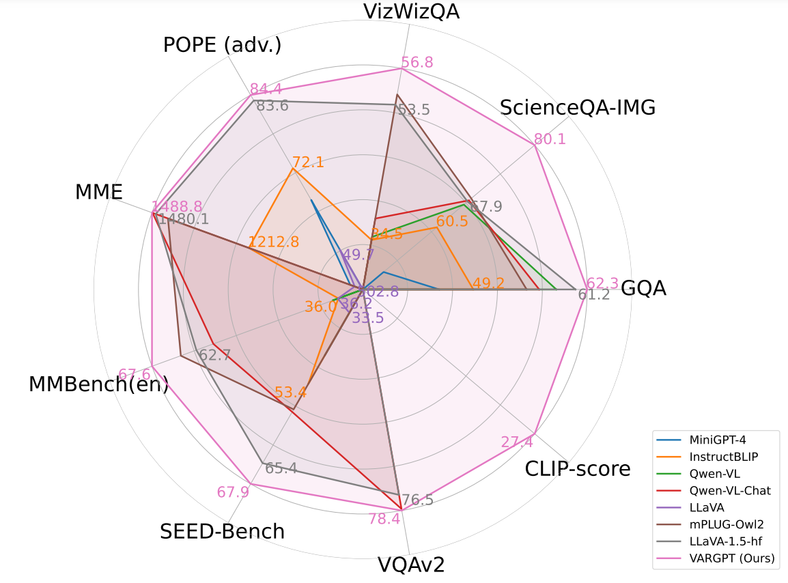
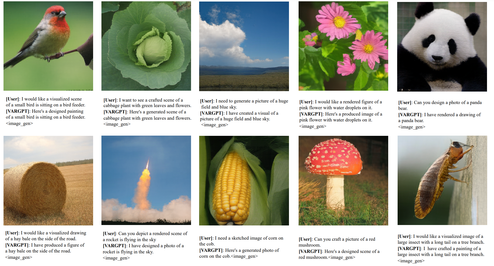
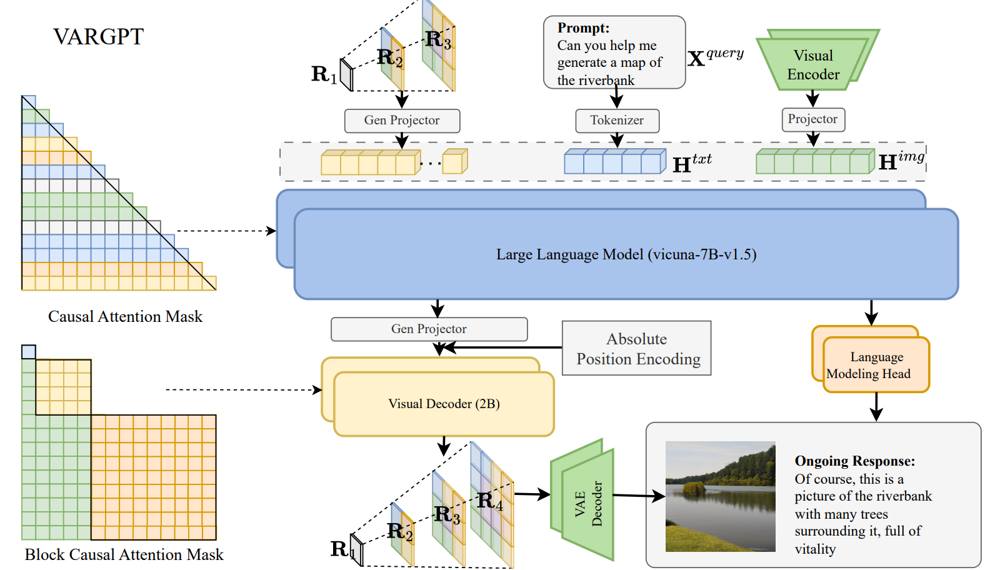
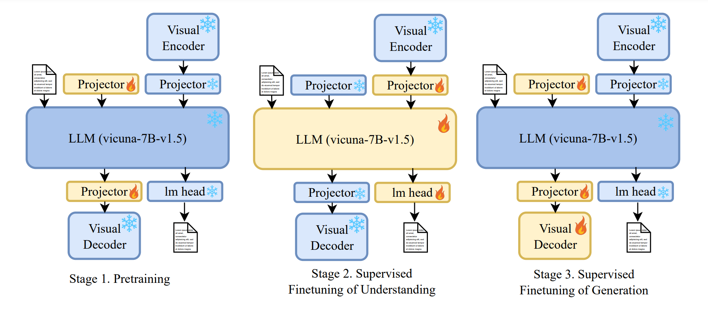
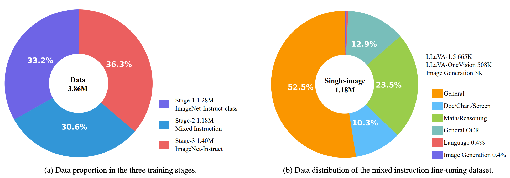

<div align="center">
<br>
<h3>VARGPT: Unified Understanding and Generation in a Visual Autoregressive Multimodal Large Language Model</h3>

Xianwei Zhuang<sup>1&#42;</sup>&nbsp;
Yuxin Xie<sup>1&#42;</sup>&nbsp;
Yufan Deng<sup>1&#42;</sup>&nbsp;
<br>
Liming Liang<sup>1</sup>&nbsp;
Jinghan Ru<sup>1</sup>&nbsp;
Yuguo Yin<sup>1</sup>&nbsp;
 Yuexian Zou <sup>1</sup>&nbsp;

<sup>1</sup> Peking University
 
[](https://arxiv.org/pdf/2501.12327) [](https://vargpt-1.github.io/) [](https://huggingface.co/VARGPT-family/VARGPT_LLaVA-v1) [](https://huggingface.co/datasets/VARGPT-family/VARGPT_datasets) [](https://github.com/VARGPT-family/VARGPT/blob/main/LICENSE)
</div>

## News

* **[In progress]** We will explore a more powerful model architecture and use more data to support the unified generation and understanding of various modalities including images, videos, and texts in the next version. Stay tuned! 🔥🔥🔥🔥🔥🔥🔥🔥🔥🔥
* **[2025-01-22]** We release the datasets for training VARGPT (**7B+2B**). 🔥🔥

* **[2025-01-21]** We release the **model and inference code** of VARGPT (**7B+2B**) for multimodal understanding and generation including image captioning, visual question answering (VQA), text-to-image generation. 🔥🔥

## What is the new about VARGPT?
<p align="center">

</p>

<p align="center">

</p>

Below is a comparison among understanding only, generation only, and unified (understanding \& generation) models. `Image` and `Text` indicate the representations from specific input modalities. VARGPT modeling understanding and generation as two distinct paradigms within a unified model: **predicting the next token for visual understanding and predicting the next scale for visual generation**
<p align="center">

</p>

Below is an overview of **VARGPT** and proposed unified three-stage instruction tuning. VARGPT is capable of handling image captioning, visual question answering, text-to-image generation and mixed modality generation.

<p align="center">

</p>
<p align="center">

</p>


The visual generation capabilities of VARGPT are currently constrained by the limitations of its training data, which is derived from the ImageNet dataset (1.28M images). In the forthcoming iteration, we intend to implement substantial enhancements to both the quality and quantity of the training data.

<br/>

## TODO
- [X] Release the inference code.
- [X] Release the code for evaluation.
- [X] Release the model checkpoint.
- [X] Release the datasets.
- [ ] Supporting stronger visual generation capabilities.
- [ ] Release the training code.

## Hugging Face models and annotations

The VARGPT checkpoints can be found on [Hugging Face](https://huggingface.co):
* [VARGPT-family/VARGPT_LLaVA-v1](https://huggingface.co/VARGPT-family/VARGPT_LLaVA-v1)

The instruction for training data can be found on [Hugging Face](https://huggingface.co):
* [VARGPT-family/VARGPT_datasets](https://huggingface.co/datasets/VARGPT-family/VARGPT_datasets)

## Getting Started
First, set up the environment:
```
pip3 install -r requirements.txt
```

The description of code structure:
```bash
VARGPT_code/
├── inference           # Inference code for understanding and generation.
├── patching_utils      # Patching utils for supporting VARGPT.
├── README.md
├── requirements.txt    # Requirements for inference code.
├── understand_eval     # Evaluation code for understanding.
└── vargpt_llava        # Complete model architecture code.

```
### Multimodal Understanding
Inference demo for **Multimodal Understanding**. You can execute the following shell:
```shell
python3 inference/understanding_vargpt.py
```
Or executing the following code:
```python
# Or execute the following code
import requests
from PIL import Image

import torch
from transformers import AutoProcessor, AutoTokenizer
from vargpt_llava.modeling_vargpt_llava import VARGPTLlavaForConditionalGeneration
from vargpt_llava.prepare_vargpt_llava import prepare_vargpt_llava 
from vargpt_llava.processing_vargpt_llava import VARGPTLlavaProcessor
from patching_utils.patching import patching

model_id = "VARGPT-family/VARGPT_LLaVA-v1"
prepare_vargpt_llava(model_id)

model = VARGPTLlavaForConditionalGeneration.from_pretrained(
    model_id, 
    torch_dtype=torch.float32, 
    low_cpu_mem_usage=True, 
).to(0)
patching(model)

tokenizer = AutoTokenizer.from_pretrained(model_id)
processor = VARGPTLlavaProcessor.from_pretrained(model_id)

# Define a chat history and use `apply_chat_template` to get correctly formatted prompt
# Each value in "content" has to be a list of dicts with types ("text", "image") 
conversation = [
    {
      "role": "user",
      "content": [
          {"type": "text", "text": "Please explain the meme in detail."},
          {"type": "image"},
        ],
    },
]
prompt = processor.apply_chat_template(conversation, add_generation_prompt=True)
image_file = "./assets/llava_bench_demo.png"
print(prompt)

raw_image = Image.open(image_file)
inputs = processor(images=raw_image, text=prompt, return_tensors='pt').to(0, torch.float32)

output = model.generate(
    **inputs, 
    max_new_tokens=2048, 
    do_sample=False)

print(processor.decode(output[0], skip_special_tokens=True))


```
### Multimodal Generation


Inference demo for **Text-to-Image Generation**. You can execute the following shell:
```shell
python3 inference/generation_vargpt.py
```
Or executing the following code:
```python
import requests
from PIL import Image

import torch
from transformers import AutoProcessor, AutoTokenizer
from vargpt_llava.modeling_vargpt_llava import VARGPTLlavaForConditionalGeneration
from vargpt_llava.prepare_vargpt_llava import prepare_vargpt_llava 
from vargpt_llava.processing_vargpt_llava import VARGPTLlavaProcessor
from patching_utils.patching import patching
model_id = "VARGPT-family/VARGPT_LLaVA-v1"

prepare_vargpt_llava(model_id)

model = VARGPTLlavaForConditionalGeneration.from_pretrained(
    model_id, 
    torch_dtype=torch.float32, 
    low_cpu_mem_usage=True, 
).to(0)

patching(model)
tokenizer = AutoTokenizer.from_pretrained(model_id)
processor = VARGPTLlavaProcessor.from_pretrained(model_id)

# some instruction examples:
# Please design a drawing of a butterfly on a flower.
# Please create a painting of a black weasel is standing in the grass.
# Can you generate a rendered photo of a rabbit sitting in the grass.
# I need a designed photo of a lighthouse is seen in the distance.
# Please create a rendered drawing of an old photo of an aircraft carrier in the water.
# Please produce a designed photo of a squirrel is standing in the snow.


conversation = [
    {
      "role": "user",
      "content": [
          {"type": "text", "text": "Please design a drawing of a butterfly on a flower."},
        ],
    },
]
prompt = processor.apply_chat_template(conversation, add_generation_prompt=True)
print(prompt)

inputs = processor(text=prompt, return_tensors='pt').to(0, torch.float32)
model._IMAGE_GEN_PATH = "output.png"
output = model.generate(
    **inputs, 
    max_new_tokens=2048, 
    do_sample=False)

print(processor.decode(output[0], skip_special_tokens=True))

```

### Performance Evaluation

Following [lmms-eval](https://github.com/EvolvingLMMs-Lab/lmms-eval) you can install the package by cloning the repository and running the following command:
```bash
cd understand_eval
pip install -e .
```

To evaluate the performance of the model in multimodel understanding, you can execute the following shell:
```bash
python3 -m accelerate.commands.launch \
    --num_processes=8 \
    --main_process_port=39535 \
    -m lmms_eval \
    --model vargpt_llava \
    --model_args pretrained="path/to/VARGPT_LLaVA-v1" \
    --tasks mmmu \
    --batch_size 1 \
    --log_samples \
    --log_samples_suffix llava-hf_mmmu \
    --output_path ./logs/
```


## VARGPT Training Data Preparation
### Instruction Fine-tuning Dataset Download

<p align="center">

</p>

The following content provides detailed instructions for preparing the training data for VARGPT. The data preparation process involves downloading and processing various datasets for different stages of training.

### Dataset Structure

1. `stage1-pt`: Contains 1.28M pre-training instruction fine-tuning dataset for VARGPT.

2. `stage2-sft`: Includes datasets for the second stage of VARGPT instruction fine-tuning:
   - `stage2-sft/llava_v1_5_mix665k`: Derived entirely from [LLaVA-1.5](https://huggingface.co/datasets/liuhaotian/LLaVA-Instruct-150K/blob/main/llava_v1_5_mix665k.json) training data.
   - `stage2-sft/llava_onevision_508k`: Sampled from the [LLaVA-onevision Dataset](https://huggingface.co/datasets/lmms-lab/LLaVA-OneVision-Data).
   - `stage2-sft/ImageNet-Instruct-5k`: Sampled from our `stage3-sft/ImageNet-Instruct-130k` dataset.

3. `stage3-sft`: Contains datasets for the third stage of VARGPT instruction fine-tuning:
   - `stage3-sft/ImageNet-Instruct-130k`
   - `stage3-sft/ImageNet-Instruct-1270k`

### Image Data Download and Processing

To prepare the image data, download the following datasets:

1. ImageNet: [ImageNet](https://huggingface.co/datasets/ILSVRC/imagenet-1k)
2. COCO: [train2017](http://images.cocodataset.org/zips/train2017.zip)
3. GQA: [images](https://downloads.cs.stanford.edu/nlp/data/gqa/images.zip)
4. OCR-VQA: [images](https://drive.google.com/drive/folders/1_GYPY5UkUy7HIcR0zq3ZCFgeZN7BAfm_?usp=sharing)
5. TextVQA: [train_val_images](https://dl.fbaipublicfiles.com/textvqa/images/train_val_images.zip)
6. VisualGenome: [part1](https://cs.stanford.edu/people/rak248/VG_100K_2/images.zip), [part2](https://cs.stanford.edu/people/rak248/VG_100K_2/images2.zip)
7. LLaVA-Onevision Dataset: [LLaVA-Onevision Dataset](https://huggingface.co/datasets/lmms-lab/LLaVA-OneVision-Data)

#### Matching Instruction Fine-tuning Data Paths with Image Paths

For datasets `ImageNet-Instruct-class`, `ImageNet-Instruct-130k`, and `ImageNet-Instruct-1270k`, use the following Python script to match image paths with ImageNet image UIDs:

```python
from tqdm import tqdm
import glob
import os
import json
import pandas as pd

def build_image_mapping(parquet_folder_path):
    image_mapping = {}
    label_mapping = {}
    parquet_files = glob.glob(os.path.join(parquet_folder_path, "train-*.parquet"))
    
    for file_idx, parquet_file in enumerate(tqdm(parquet_files)):
        file_path = os.path.join(parquet_folder_path, parquet_file)
        df = pd.read_parquet(file_path)
        
        for idx in range(len(df)):
            img_path = df.iloc[idx]['image']['path']
            image_filename = f"image_{file_idx}_{idx}.jpg"
            prefix = img_path.split('_')[0] + '_' + img_path.split('_')[1]
            image_mapping[prefix] = image_filename
            label_mapping[os.path.join("", image_filename)] = df.iloc[idx]['label']
    return image_mapping, label_mapping

image_mapping, label_mapping = build_image_mapping("ImageNet/data")
```

This script creates two mappings:
1. `image_mapping`: Maps the original image prefixes to new image filenames.
2. `label_mapping`: Associates the new image filenames with their corresponding labels.

#### Additional Notes

- Ensure all datasets are downloaded and stored in appropriate directories before running the script.
- The script assumes a specific structure for the ImageNet parquet files. Adjust the path and file naming convention if necessary.
- After running the script, you can use `image_mapping` and `label_mapping` for further data processing or model training tasks.

For any issues or further clarification, please refer to the project documentation or contact the maintainers.


### Citation
To cite the paper and model, please use the below:
```
@misc{zhuang2025vargptunifiedunderstandinggeneration,
      title={VARGPT: Unified Understanding and Generation in a Visual Autoregressive Multimodal Large Language Model}, 
      author={Xianwei Zhuang and Yuxin Xie and Yufan Deng and Liming Liang and Jinghan Ru and Yuguo Yin and Yuexian Zou},
      year={2025},
      eprint={2501.12327},
      archivePrefix={arXiv},
      primaryClass={cs.CV},
      url={https://arxiv.org/abs/2501.12327}, 
}
```
### Acknowledgments
This work is heavily based on [LLaVA-1.5](https://github.com/haotian-liu/LLaVA), [VAR](https://github.com/FoundationVision/VAR), [LLaVA-NeXT](https://llava-vl.github.io/blog/2024-01-30-llava-next), [lmms-eval](https://github.com/EvolvingLMMs-Lab/lmms-eval), [Show-o](https://github.com/showlab/Show-o), [LLaMA-Factory](https://github.com/hiyouga/LLaMA-Factory), [CLIP](https://github.com/openai/CLIP), [transformers-hf](https://github.com/huggingface/transformers). Thanks to all the authors for their great work.
